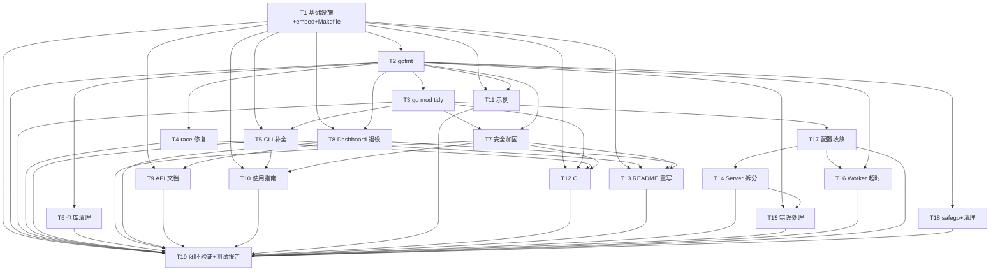
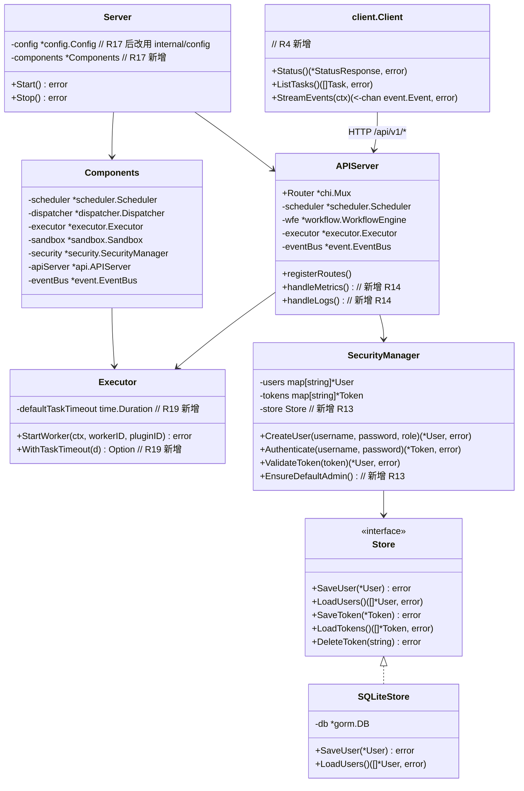
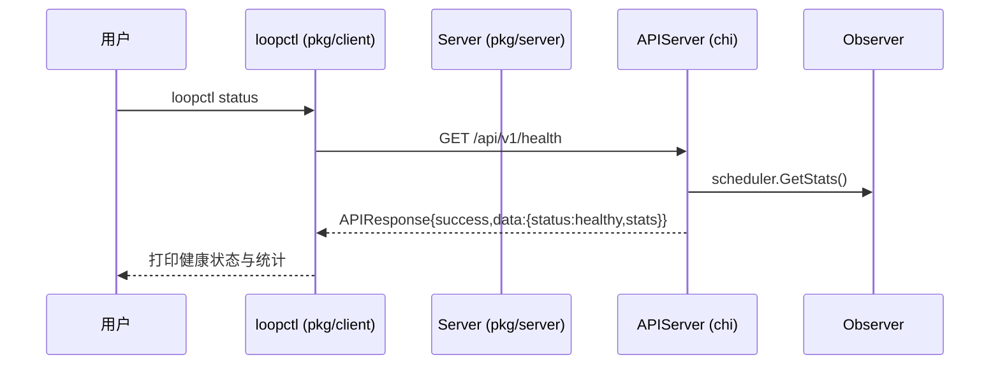

# LoopWorker 补全设计文档（架构师：高见远）

> ⚠️ **历史文档，勿照此实施。** 本文档记录 2026-08-15 的补全方案，以下决策与当前代码**已经不一致**：
> - **D2 计划新增的 `/api/v1/metrics` 与 `/api/v1/logs` 端点从未实现**，指标与日志只在 loopback
>   admin 监听器上（`server.admin_port`，默认 19528），需要 admin 凭据。README 与
>   `docs/api/api-reference.md` 已按真实路由修正。
> - **D3 计划「补全 5 个 CLI」**：`loopctl` 已按真实端点重写；`loopbench` / `loopdebug` /
>   `loopsim` / `loopwatch` 仍是本地玩具，未与服务端交互，**是否保留待产品裁决**。
> - **D4 计划复用 gorm/sqlite 持久化 User/Token**：gorm 已从 `go.mod` 移除（零 import），
>   `SecurityManager` 至今**没有任何生产调用方**。
> - **D5 计划删除 `pkg/server.Config`**：未执行；`internal/config` 与 `pkg/server` 仍是两套，
>   由 `pkg/server` 的装配层收口。
>
> 真实状态以 [AGENT-COLLABORATION-SPEC.md](../../AGENT-COLLABORATION-SPEC.md) §8/§10 为准。
> 本文档保留是为了记录当时的判断与取舍，不作为实施依据。

> 文档版本：v1.0
> 作者：高见远（架构师）
> 日期：2026-08-15
> 上游输入：`docs/product/gap-audit-and-prd.md`（产品经理许清楚，22 项需求 R1-R22）
> 目标项目：`D:\Destop\test\loopWorker-for-go`
> 本文档定位：为工程师提供**可直接实施**的补全方案 + 任务分解（T1-T19，一个任务一个 commit）

---

## 0. 设计决策摘要（5 个关键决策）

| # | 决策点 | 结论（一句话） | 对应 PRD |
|---|--------|---------------|----------|
| D1 | **embed 链路** | 提交**真实构建产物**到 `pkg/api/dist/`（git 跟踪），`make web-build` 用 Node 构建并复制覆盖；无 Node 时**显式回退已提交产物**（校验非占位符），禁止静默占位符 | R1/R2/R11 |
| D2 | **Dashboard 取舍** | **整体退役 `pkg/dashboard` 的 HTTP/SSE 层并删除该包**（前端 React Canvas 只用 `/api/v1/*`，dashboard 6 端点是生产死代码且与 api 重复）；观测数据面由 `pkg/api` 新增 `/api/v1/metrics`、`/api/v1/logs` 承接；R20 随之关闭 | R14/R20 |
| D3 | **CLI 取舍** | **补全 5 个 CLI 源码**（loopctl/loopbench/loopwatch/loopsim/loopdebug，各 1 个 main.go + cobra 命令），新增共享 `pkg/client`；README 已承诺且根目录有 .exe 产物、fix_encoding.py 证明历史存在 | R4 |
| D4 | **安全方案** | bcrypt 替换无盐 SHA-256（新增 `golang.org/x/crypto`）；User/Token 持久化**复用 gorm/sqlite**（项目已有依赖，新增 `Store` 接口 + `SQLiteStore`）；`NewSecurityManager()` 保持内存模式兼容；启动时默认管理员引导 | R13 |
| D5 | **配置收敛** | **以 `internal/config.Config` 为唯一运行时配置真相**，**删除 `pkg/server.Config`**；`pkg/config.Settings` 保留为用户偏好（外观/语言），与运行时配置分离并文档注明 | R21 |

---

## Part A. 实现方案总览

### A.1 架构模式与总体策略

- **保持现有分层**（pkg 公开层 / internal 核心层），不引入容器、不重写核心引擎。
- **M1/M2 以"交付面修复"为主**（构建链路、文档、CLI、CI、安全），**M3 以"架构债务收敛"为主**，全部采用**最小可行改动**，避免大规模重构引入回归。
- 新增依赖仅 `golang.org/x/crypto`（bcrypt），其余复用现有 chi / cobra / viper / gorm / zap / prometheus。
- 前端保持 Vite + React（不引入 MUI，避免扩大改动面，遵循 PRD）。

### A.2 R1-R22 逐项实现方案

#### M1（P0）

**R1 修复 embed 编译阻断**
- 涉及文件：`Makefile`（修改）、`pkg/api/dist/**`（新建，提交真实产物）
- 改动方式：见 D1 与难点 1 的 Makefile target 设计。`pkg/api/api.go:27` 的 `//go:embed all:dist` 保持不变（embed 只能引用包内相对路径，`web/canvas/dist` 在包外无法直接 embed）。
- 验收：`go build ./...`、`go vet ./...`、`make build` 全部成功。

**R2 打通前端构建产物链路**
- 涉及文件：`Makefile`（修改）、`web/canvas/vite.config.js`（可选微调，无需大改）、`.github/workflows/ci.yml`（新建，CI 产物校验）
- 改动方式：`make web-build` = `npm ci && npm run build && cp -r web/canvas/dist/. pkg/api/dist/`；CI 增加"产物非占位符"校验（`grep -v "Placeholder" pkg/api/dist/index.html`）。
- 验收：`make web-build` 后 `/` 返回真实 Canvas UI（含 `/assets/*` 脚本资源）。

**R3 gofmt 全量格式化**
- 涉及文件：审计出的 16 个 Go 文件（`integration/integration_test.go`、`internal/core/executor/executor.go`、api/dashboard/event/plugin/research/server/skill/workflow/executor/observer/sandbox/scheduler/bridge 等）
- 改动方式：`gofmt -w` 全量；`make check` 增加 `test -z "$$(gofmt -l .)"` 门槛。
- 验收：`gofmt -l .` 输出为空。

#### M2（P1）

**R4 补齐或移除 5 个 CLI 工具**（决策 D3：补齐）
- 涉及文件：`cmd/loopctl/main.go`、`cmd/loopbench/main.go`、`cmd/loopwatch/main.go`、`cmd/loopsim/main.go`、`cmd/loopdebug/main.go`（全部新建）、`pkg/client/client.go`（新建，共享 HTTP 客户端）
- 工具职责边界（详见难点 3）：
  - `loopctl`：管理面——`status`（健康检查）、`tasks`（任务列表）、`init`（初始化 `~/.loopworker` 目录与默认配置）
  - `loopbench`：压测面——`run --tasks N --workers M`（对运行中 server 批量创建任务并统计吞吐/耗时）
  - `loopwatch`：观测面——`stream`（连接 `/api/v1/events/live` 打印事件流，类 `tail -f`）
  - `loopsim`：本地模拟——不依赖 server，直接 import `internal/core` 在内存中跑一个调度+执行演示流程
  - `loopdebug`：调试面——`events`（dump 本地事件存储）、`config`（打印生效配置）、`plugins`（列出插件目录）
- 验收：`go build ./cmd/...` 成功；`loopctl init` 可运行；README 工具表与源码一一对应。

**R5 修复 race**
- 涉及文件：`internal/core/observer/observer_integration_test.go`（修改）
- 改动方式：`TestTaskExecutionEventFlow` 中 `expectedEvents map` 由测试 goroutine 写、主测试读 → 用 `sync.Mutex` 保护（或改为每事件一个 `chan struct{}`）。最小 diff 方案：加 `var mu sync.Mutex`，读写均加锁。
- 验收：`go test -race ./...` 全绿。

**R6 go.mod tidy**
- 涉及文件：`go.mod`、`go.sum`（修改）
- 改动方式：`go mod tidy`；charmbracelet/bubbletea 等 TUI 残留依赖移除；chi/cobra/viper/wazero/zap/gorm/prometheus 恢复为直接依赖。
- 验收：`go mod tidy -diff` 无输出；无 charmbracelet 依赖。
- 注意：R13（安全）会再新增 `golang.org/x/crypto`，届时再次 `go mod tidy`。

**R7 README 与实现一致**
- 涉及文件：`README.md`（重写，中英双语）
- 改动方式：以真实实现为准——真实路由表（`/api/v1/*`）、真实 flags（`--config/--port/--plugins-dir/--data-dir`，无 `-tui`）、真实目录结构（增补 `pkg/{ai,debugger,detector,generator,research,service,skill}` 或删除不存在项）、真实配置示例（viper 扁平 key）、CLI 工具表（6 个真实工具）、"从零构建"一条命令流程。
- 验收：README 中无虚假声明；按 README 可完成构建与启动。

**R8 补 API 参考文档**
- 涉及文件：`docs/api/api-reference.md`（新建，替换空 .gitkeep）
- 内容：每个真实端点 method/path/参数/请求示例/响应示例/错误码（详见 A.3 真实路由清单）。
- 验收：文档端点与 `pkg/api/api.go` 路由一一对应。

**R9 补使用指南**
- 涉及文件：`docs/guides/getting-started.md`、`docs/guides/configuration.md`、`docs/guides/security.md`、`docs/guides/wasm-plugins.md`、`docs/guides/observability.md`（新建，替换空 .gitkeep）
- 内容：快速开始 / 配置说明 / 安全与鉴权（含默认管理员引导）/ WASM 插件开发 / 观测与监控。
- 验收：5 篇文档均基于真实行为撰写。

**R10 补可运行示例**
- 涉及文件：`examples/simple/main.go`（新建，最小可运行工作流）、`examples/workflow/README.md`、`examples/hello-plugin/README.md`、`examples/wasm/rust_agent/README.md`（新建）
- 改动方式：`examples/simple` 放一个 `go run ./examples/simple` 即可跑的最小 scheduler+executor 演示；README 标注每个示例的运行命令与前置条件。
- 验收：`go run ./examples/simple` 成功输出任务完成。

**R11 Makefile 完善**（与 T1 合并实施）
- 涉及文件：`Makefile`（重构）
- 改动方式：`build` 依赖 `web-build`；新增 `install`（`go install ./cmd/...`）、`test-all`（fmt+vet+test+race+tidy 组合）、`test-e2e`（`go test -tags=e2e ./test/e2e/...`，若无可先指向 integration）；删除 `run-tui`；`check` 升级为 fmt+vet+test+tidy-diff 全门槛。
- 验收：`make help` 与 target 一致；`make check` 通过。

**R12 建立 CI**
- 涉及文件：`.github/workflows/ci.yml`（新建）
- 内容：Ubuntu + Go 1.26 + Node 20；steps：setup-go、setup-node、`npm ci && npm run build`（web/canvas）、复制 dist、`gofmt -l` 检查、`go vet`、`go test ./...`、`go test -race ./...`、`go mod tidy -diff`、`make build`、前端产物非占位符校验。
- 验收：push/PR 自动执行，任一步失败则红。

**R13 安全加固**（决策 D4，详见难点 4）
- 涉及文件：`pkg/security/security.go`（修改：bcrypt + Store 接入）、`pkg/security/store.go`（新建：`Store` 接口 + `SQLiteStore`）、`pkg/security/security_test.go`（修改：适配哈希实现）、`pkg/server/server.go`（修改：注入 store + 默认管理员引导）、`go.mod`（新增 x/crypto）
- 验收：重启进程后用旧 token 仍可认证；密码哈希为 bcrypt 格式（`$2a$...`）。

**R14 统一 Dashboard 路由**（决策 D2，详见难点 2）
- 涉及文件：`pkg/dashboard/dashboard.go`、`pkg/dashboard/dashboard_test.go`（删除）、`pkg/server/server.go`（修改：移除 dashboard 引用）、`pkg/api/api.go`（修改：新增 `/api/v1/metrics`、`/api/v1/logs` 薄端点）
- 验收：`go test ./...` 不再出现 DefaultServeMux 冲突；`pkg/server` 与 `pkg/dashboard` 测试互不干扰（dashboard 包已退役）。

**R15 清理仓库污染**
- 涉及文件（删除）：`integration/loopworker_tasks.db`、`pkg/server/loopworker_tasks.db`、`pkg/dashboard/loopworker_tasks.db`（随 R14 一并）、`internal/core/*/loopworker_tasks.db`、根目录 `coverage`、根目录 6 个 `.exe` + `e2e.test.exe`、`fix_encoding.py`
- 改动方式：`coverage` 由 Makefile `test-cover` 动态生成（已具备，无需提交）；确认 `.gitignore` 已覆盖 `*.db`/`*.exe`/`coverage`。
- 验收：`git status` 干净；工作区无运行期产物。

**R16 更新测试报告**（放 M4，见 T19）
- 涉及文件：`docs/test-report.md`（重写）
- 内容：以实际为准——真实包数（23）、真实测试数、真实 CLI 数（6）；标注生成命令与日期。

#### M3（P2）

**R17 Server 拆分/依赖注入**（决策 D7，详见难点 7）
- 涉及文件：`pkg/server/components.go`（新建）、`pkg/server/server.go`（修改）、`pkg/server/server_test.go`（修改/新增生命周期测试）
- 改动方式：`BuildComponents(cfg) (*Components, error)` 集中组件构造；`Server` 持有 `*Components`；`New(cfg)` = `BuildComponents` + `NewServer(cfg, comps)`；`Start()` 启动错误向上传播；新增 `TestServerStartStop` 等生命周期测试。
- 验收：`pkg/server` 测试覆盖启动/停止生命周期；`_ = s.observer.Start(...)` 等不再出现。

**R18 错误处理一致化**
- 涉及文件：`internal/core/{dispatcher,executor,observer,sandbox,scheduler}/*.go`、`pkg/{api,plugin,research,service,workflow}/*.go`、`pkg/server/server.go` 中约 20 处 `_ =`（详见 A.4 清单）
- 改动方式：事件发布失败 → `fmt.Fprintf(os.Stderr, "[event] publish %s: %v", ...)`（不阻断主流程）；`Start/StartWorker/StopAllWorkers` 类错误 → 返回并向上传播；`prometheus.Register` 重复注册错误 → 忽略但注释说明（或改用 MustRegister 前判断）。
- 验收：非测试代码 `grep -rn "_ = .*Publish"` 仅剩注释说明的合理豁免。

**R19 Worker 全局执行超时**
- 涉及文件：`internal/core/executor/executor.go`（修改：`WithTaskTimeout` option + workerLoop 超时 ctx）、`internal/config/config.go`（修改：`Executor` 配置块 `task_timeout_seconds`）、`internal/core/executor/executor_test.go`（新增超时测试）
- 改动方式：`NewExecutor(..., executor.WithTaskTimeout(d))`（option 模式，保持既有调用兼容）；workerLoop 中非 Agent 任务执行包 `context.WithTimeout`；任务级覆盖：`task.Config["timeout_seconds"]` 优先；超时 → 走现有失败/重试路径。
- 验收：配置默认值（300s）+ 任务级覆盖生效；有超时转失败测试。

**R20 Dashboard 生命周期**
- 处理：**随 R14 退役关闭**。原问题（15 个 goroutine 无 Stop）因 `pkg/dashboard` 退役而不复存在；文档中注明该缺口关闭理由。若未来重建 dashboard，必须遵循"goroutine 使用可取消 ctx + 显式 Stop"约定。

**R21 配置收敛**（决策 D5，详见难点 6）
- 涉及文件：`pkg/server/server.go`（修改：删除 `Config`/`DefaultConfig`）、`cmd/loopworker/main.go`（修改：组装 `internal/config.Config`）、`pkg/server/server_test.go`（修改：改用 `internal/config.DefaultConfig`）
- 改动方式：删除 `pkg/server.Config`；`server.New(cfg *config.Config)`；main.go 用 viper 扁平 key + env 覆盖组装 `internal/config.Config`；`pkg/config.Settings` 保留为用户偏好（外观/语言/安全策略），文档注明分离。
- 验收：`grep -rn "server.Config"` 无结果；`internal/config` 为唯一运行时配置。

**R22 全局 logger 竞态修复 + 空目录清理**
- 涉及文件：`pkg/utils/safego.go`（修改：`defaultLogger` 改 `atomic.Pointer[Logger]`）、删除空目录 `pkg/core/`、`pkg/detector/`、`cmd/loopworker/cmd/`、删除 `web/canvas/src/assets/react.svg`、`web/canvas/src/assets/vite.svg`
- 改动方式：`SetLogger`/`GoSafe` 读写经 atomic；删除残留模板资源（保留 `hero.png`，若被引用）。
- 验收：`go test -race ./pkg/utils/...` 全绿；空目录与模板残留清理。

#### M4（闭环验证）

**R1-R22 全量回归 + R16 测试报告**
- 涉及文件：`docs/test-report.md`（重写）、全仓
- 动作：按 README 从零 clone→`make build`→`make check`→启动→curl `/api/v1/health`、`/metrics`→浏览器访问 `/`；更新测试报告为真实数据。

### A.3 真实路由清单（R8 依据，实施后以代码为准）

| Method | Path | 说明 | 备注 |
|--------|------|------|------|
| GET | `/api/v1/health` | 健康检查（含 scheduler stats） | 已有 |
| GET | `/api/v1/tasks/` | 任务列表 | 已有 |
| POST | `/api/v1/tasks/` | 创建任务 | 已有 |
| GET | `/api/v1/tasks/{taskID}` | 任务详情 | 已有 |
| DELETE | `/api/v1/tasks/{taskID}` | 取消任务 | 已有 |
| POST | `/api/v1/tasks/{taskID}/dependencies` | 添加依赖 | 已有 |
| GET | `/api/v1/workers/` | Worker 列表 | 已有 |
| GET | `/api/v1/workflow/graph` | 工作流 DAG 图（React Flow 数据） | 已有 |
| GET | `/api/v1/workflow/list` | 工作流列表 | 已有 |
| POST | `/api/v1/workflow/execute` | 执行工作流 | 已有 |
| GET | `/api/v1/events/live` | SSE 事件流 | 已有 |
| GET | `/api/v1/metrics` | 观测指标（observer.GetMetrics） | **新增（R14）** |
| GET | `/api/v1/logs` | 观测日志（observer.GetLogs） | **新增（R14）** |
| GET | `/metrics` | Prometheus 指标 | 已有 |
| GET | `/*` | Canvas UI（embed） | 已有 |

### A.4 错误处理改造清单（R18 范围，非测试代码）

| 文件 | 位置 | 处理方式 |
|------|------|----------|
| internal/core/dispatcher/dispatcher.go | `Publish` ×2、`StartTask` | Publish 失败记日志；StartTask 返回错误并传播 |
| internal/core/executor/executor.go | `Publish` ×3、`StopWorker` ×2、`StartWorker`（watchdog reborn） | Publish 记日志；watchdog 重生失败记日志并继续（不阻断主循环，注释说明） |
| internal/core/observer/observer.go | `prometheus.Register` | 重复注册忽略（注释说明：测试重复注册场景） |
| internal/core/sandbox/sandbox.go | `Publish` ×3 | 记日志 |
| internal/core/scheduler/scheduler.go | `Publish` ×6 | 记日志 |
| pkg/api/api.go | `wfe.Execute` | 记日志 |
| pkg/plugin/manager.go | `Publish` ×2 | 记日志 |
| pkg/research/research.go | `Publish` ×1 | 记日志 |
| pkg/server/server.go | `observer.Start`、`executor.StartWorker` | 返回错误并传播 |
| pkg/service/service.go | `cmd.Run`、`Stop` | 记日志 |
| pkg/workflow/workflow.go | `Publish` ×3 | 记日志 |

统一日志格式：`fmt.Fprintf(os.Stderr, "[event] publish %s: %v\n", evt.Type(), err)`；Start 类：`return fmt.Errorf("start observer: %w", err)`。

---

## Part B. 文件清单

### B.1 新建文件

| 路径 | 用途 | 所属任务 |
|------|------|----------|
| `pkg/api/dist/index.html` + `assets/*` | 提交的真实前端构建产物（embed 必需） | T1 |
| `cmd/loopctl/main.go` | 管理 CLI（status/tasks/init） | T5 |
| `cmd/loopbench/main.go` | 压测 CLI（run） | T5 |
| `cmd/loopwatch/main.go` | 事件流观测 CLI（stream） | T5 |
| `cmd/loopsim/main.go` | 本地模拟 CLI（run） | T5 |
| `cmd/loopdebug/main.go` | 调试 CLI（events/config/plugins） | T5 |
| `pkg/client/client.go` | 共享 API HTTP 客户端（Status/Tasks/StreamEvents） | T5 |
| `pkg/security/store.go` | `Store` 接口 + `SQLiteStore`（gorm） | T7 |
| `pkg/server/components.go` | `Components` 结构 + `BuildComponents` 工厂 | T14 |
| `.github/workflows/ci.yml` | CI 流水线 | T12 |
| `docs/api/api-reference.md` | API 参考文档 | T9 |
| `docs/guides/getting-started.md` | 快速开始 | T10 |
| `docs/guides/configuration.md` | 配置说明 | T10 |
| `docs/guides/security.md` | 安全与鉴权 | T10 |
| `docs/guides/wasm-plugins.md` | WASM 插件开发 | T10 |
| `docs/guides/observability.md` | 观测与监控 | T10 |
| `examples/simple/main.go` | 最小可运行示例 | T11 |
| `examples/workflow/README.md` | 示例运行说明 | T11 |
| `examples/hello-plugin/README.md` | 示例运行说明 | T11 |
| `examples/wasm/rust_agent/README.md` | 示例运行说明 | T11 |

### B.2 修改文件

| 路径 | 改动要点 | 所属任务 |
|------|----------|----------|
| `Makefile` | `build` 依赖 `web-build`；`web-build` 构建+复制+无 Node 回退策略；`check` 升级（fmt+vet+test+tidy）；新增 `install`/`test-all`；删除 `run-tui` | T1 |
| 16 个 Go 文件 | `gofmt -w` 全量格式化 | T2 |
| `go.mod` / `go.sum` | `go mod tidy`；后新增 `golang.org/x/crypto` | T3/T7 |
| `internal/core/observer/observer_integration_test.go` | `expectedEvents` map 加 mutex | T4 |
| `pkg/security/security.go` | bcrypt + Store 接入 + 默认管理员引导 | T7 |
| `pkg/security/security_test.go` | 适配 bcrypt 哈希断言 | T7 |
| `pkg/server/server.go` | 移除 dashboard；注入 security store；Start 错误传播；改用 `internal/config.Config`；`BuildComponents` | T7/T8/T14/T17 |
| `pkg/server/server_test.go` | 适配新构造；新增生命周期测试 | T14/T17 |
| `pkg/api/api.go` | 新增 `/api/v1/metrics`、`/api/v1/logs` handler；`wfe.Execute` 错误记日志 | T8/T15 |
| `cmd/loopworker/main.go` | 组装 `internal/config.Config`；删除 language/theme 扁平 key 依赖 | T17 |
| `internal/config/config.go` | 新增 `Executor{TaskTimeoutSeconds}` 配置块 | T16 |
| `internal/core/executor/executor.go` | `WithTaskTimeout` option + workerLoop 超时 ctx + Publish 错误记日志 | T15/T16 |
| `internal/core/{dispatcher,scheduler,sandbox,plugin,research,service,workflow}` | `_ =` 吞错清理 | T15 |
| `pkg/utils/safego.go` | `defaultLogger` 改 `atomic.Pointer[Logger]` | T18 |
| `README.md` | 重写（真实路由/flags/结构/配置/CLI） | T13 |
| `docs/test-report.md` | 重写为真实数据 | T19 |
| `web/canvas/src/App.jsx` 等 | 可选：确认端点与 `/api/v1/*` 一致（当前已一致，一般无需改） | — |

### B.3 删除文件

| 路径 | 理由 | 所属任务 |
|------|------|----------|
| `pkg/dashboard/dashboard.go` | 生产死代码（D2） | T8 |
| `pkg/dashboard/dashboard_test.go` | 随包删除 | T8 |
| `pkg/dashboard/loopworker_tasks.db` | 运行期污染 | T8/T6 |
| `integration/loopworker_tasks.db`、`pkg/server/loopworker_tasks.db`、`internal/core/*/loopworker_tasks.db` | 运行期污染 | T6 |
| 根目录 `coverage` | 过期快照（Makefile 动态生成） | T6 |
| 根目录 `loopworker.exe`、`loopctl.exe`、`loopbench.exe`、`loopwatch.exe`、`loopsim.exe`、`loopdebug.exe`、`e2e.test.exe` | 产物由源码构建，不入库 | T6 |
| `fix_encoding.py` | 引用已删除文件，.gitignore 已忽略 | T6 |
| 空目录 `pkg/core/`、`pkg/detector/`、`cmd/loopworker/cmd/` | 误导 | T18 |
| `web/canvas/src/assets/react.svg`、`web/canvas/src/assets/vite.svg` | Vite 默认模板残留 | T18 |

---

## Part C. 任务列表（T1-T19）

> 粒度：一个任务 = 一个 git commit。依赖链遵循"先 P0 后 P1 再 P2"。

| ID | 标题 | 里程碑 | 涉及文件（主要） | 实现要点 | 验收标准 | 依赖 |
|----|------|--------|------------------|----------|----------|------|
| **T1** | 项目基础设施：embed 链路 + Makefile 重构 | M1 | `Makefile`、`pkg/api/dist/**`（新建提交）、`web/canvas` | ① 本机 `npm ci && npm run build` 生成 `web/canvas/dist` 并复制到 `pkg/api/dist`（提交，git 跟踪）；② `Makefile`：`web-build` 支持无 Node 显式回退（校验 index.html 存在且非占位符，否则报错）；③ `build` 依赖 `web-build`；④ `check` 升级；⑤ 删除 `run-tui`；⑥ 新增 `install`/`test-all` | `go build ./...`、`go vet ./...`、`make build` 成功；`/` 返回真实 Canvas UI | — |
| **T2** | gofmt 全量格式化 + 格式化门槛 | M1 | 16 个 Go 文件、`Makefile`（check 增加 gofmt -l） | `gofmt -w` 全部未格式化文件；`make check` 用 `test -z "$$(gofmt -l .)"` 强制 | `gofmt -l .` 为空；`make check` 通过 | T1 |
| **T3** | go.mod tidy 收敛 | M2 | `go.mod`、`go.sum` | `go mod tidy`；移除 charmbracelet 系列；恢复 direct 标注 | `go mod tidy -diff` 无输出 | T2 |
| **T4** | race 修复（observer 集成测试） | M2 | `internal/core/observer/observer_integration_test.go` | `expectedEvents` map 加 `sync.Mutex`（或 channel 化） | `go test -race ./...` 全绿 | T2 |
| **T5** | 补齐 5 个 CLI 工具 + 共享客户端 | M2 | `cmd/loopctl|loopbench|loopwatch|loopsim|loopdebug/main.go`（新建）、`pkg/client/client.go`（新建） | 按 A.2/R4 职责实现；cobra 命令；loopctl/loopwatch/loopbench 走 `pkg/client`；loopsim 本地模拟 | `go build ./cmd/...` 成功；`loopctl init`、`loopsim run` 可运行 | T1、T3 |
| **T6** | 仓库污染清理 | M2 | 删除 `*.db`、`coverage`、根目录 `.exe`、`fix_encoding.py` | 清理运行期产物；确认 .gitignore 覆盖 | `git status` 干净；`make test-cover` 仍可生成 coverage | T2 |
| **T7** | 安全加固：bcrypt + SQLite 持久化 + 默认管理员 | M2 | `pkg/security/security.go`、`pkg/security/store.go`（新建）、`pkg/security/security_test.go`、`pkg/server/server.go`、`go.mod` | ① `HashPassword` 改 bcrypt（签名不变）；② `Authenticate` 用 `bcrypt.CompareHashAndPassword`；③ `Store` 接口 + `SQLiteStore`（gorm，表 users/tokens）；④ `NewSecurityManagerWithStore(db)`；⑤ 启动时 `EnsureDefaultAdmin`（无用户则创建 admin，一次性密码打印 stderr）；⑥ `go get golang.org/x/crypto` + tidy | 重启进程后旧 token 仍可认证；哈希为 `$2a$...`；现有 security 测试通过 | T3、T2 |
| **T8** | Dashboard 路由统一：退役 dashboard 包 | M2 | `pkg/dashboard/dashboard.go`、`pkg/dashboard/dashboard_test.go`（删除）、`pkg/server/server.go`、`pkg/api/api.go` | ① 删除 dashboard 包（含 indexHTML、SSE、StartEventListening）；② `pkg/server` 移除 dashboard 字段/引用；③ `pkg/api` 新增 `/api/v1/metrics`、`/api/v1/logs` 薄 handler（observer 数据） | `go test ./...` 无 DefaultServeMux 冲突；`curl /api/v1/metrics` 返回 JSON | T1、T2 |
| **T9** | API 参考文档 | M2 | `docs/api/api-reference.md`（新建） | 按 A.3 真实路由清单编写：method/path/参数/请求响应示例/错误码 | 文档端点与 `pkg/api` 路由一致 | T1、T8 |
| **T10** | 使用指南 5 篇 | M2 | `docs/guides/*.md`（新建） | 快速开始/配置/安全/插件/观测，均基于真实行为 | 5 篇文档齐全且可操作 | T1、T5、T7 |
| **T11** | 可运行示例 | M2 | `examples/simple/main.go`（新建）、各示例 README | `examples/simple` 最小可运行 workflow；README 标注运行命令与前置条件 | `go run ./examples/simple` 成功 | T1、T2 |
| **T12** | CI 建立 | M2 | `.github/workflows/ci.yml`（新建） | Go 1.26 + Node 20；build/test/race/vet/gofmt/tidy-diff/前端产物校验全链路 | push/PR 自动执行；任一步失败红 | T1、T3、T4、T7 |
| **T13** | README 重写 | M2 | `README.md` | 真实路由/flags/目录/配置/CLI；从零构建一条命令 | README 与实现一致 | T1、T5、T7、T8 |
| **T14** | Server 拆分/依赖注入 | M3 | `pkg/server/components.go`（新建）、`pkg/server/server.go`、`pkg/server/server_test.go` | `Components` + `BuildComponents(cfg)`；`New` 显式组装；`Start` 错误传播；新增生命周期测试 | `pkg/server` 测试覆盖 Start/Stop；无 `_ = observer.Start` | T17 |
| **T15** | 错误处理一致化 | M3 | 见 A.4 清单（约 15 个文件） | Publish 失败记日志；Start 类错误传播；统一日志格式 | 非测试代码无静默 `_ =` 吞错 | T2、T14 |
| **T16** | Worker 全局执行超时 | M3 | `internal/core/executor/executor.go`、`internal/config/config.go`、`internal/core/executor/executor_test.go` | `WithTaskTimeout` option（默认 300s）；workerLoop 超时 ctx；`task.Config["timeout_seconds"]` 覆盖；超时转失败 | 超时测试通过；配置默认值+覆盖生效 | T2、T17 |
| **T17** | 配置收敛 | M3 | `pkg/server/server.go`、`cmd/loopworker/main.go`、`pkg/server/server_test.go` | 删除 `server.Config`；`server.New(cfg *config.Config)`；main.go 用 viper+env 组装；删除 Language/Theme 扁平 key | `grep -rn "server.Config"` 无结果；`make build` + 启动正常 | T3 |
| **T18** | safego 竞态修复 + 空目录/模板清理 | M3 | `pkg/utils/safego.go`、删除空目录与模板资源 | `defaultLogger` 改 `atomic.Pointer[Logger]`；删 `pkg/core`/`pkg/detector`/`cmd/loopworker/cmd`；删 react.svg/vite.svg | `go test -race ./pkg/utils/...` 全绿 | T2 |
| **T19** | 全量闭环验证 + 测试报告 | M4 | `docs/test-report.md`（重写）、全仓 | 按 README 从零构建→`make check`→启动→curl health/metrics→浏览器 `/`；`go test ./... -v` 统计真实包数/用例数；更新 test-report | 全链路绿灯；test-report 为真实数据 | T1-T18 全部 |

### C.1 任务依赖图



**并行策略**：
- `T4/T5/T6/T9/T10/T11`（除依赖 T1/T2/T3 外）彼此可并行——文档类（T9/T10）可与代码类（T4/T5/T6）并行。
- `T7`（安全）与 `T8`（dashboard 退役）互不依赖，可并行。
- `T12`（CI）依赖多个实现任务，建议在 M2 中后期启动（依赖就绪即开）。
- M3 中 `T15/T16/T18` 在各自依赖就绪后可并行；`T14` 依赖 `T17`（先收敛配置再拆 Server）。
- `T19` 收口，串行于全部。

---

## Part D. 共享知识/约定

### D.1 跨文件约定

1. **API 响应格式**：统一 `APIResponse{success, data, error, timestamp, request_id}`（已由 `pkg/api` 定义，文档与客户端须遵循）。
2. **路由前缀**：REST 一律 `/api/v1/*`；Prometheus 指标在 `/metrics`；前端在 `/*`。
3. **错误处理策略**：
   - 事件发布失败（`EventBus.Publish`）→ 记 `fmt.Fprintf(os.Stderr, "[event] publish %s: %v\n", evt.Type(), err)`，**不阻断主流程**（背压/关闭是正常场景）。
   - `Start/Stop` 类生命周期调用 → 返回 `error` 并向上传播（`return fmt.Errorf("start observer: %w", err)`）。
   - 非测试代码**禁止**静默 `_ =` 吞错；确需忽略处必须注释说明理由。
4. **Context 规范**：所有 goroutine 必须使用可取消 ctx（`context.WithCancel/WithTimeout`）；禁止 `context.Background()` 直接进 goroutine 循环（R20 教训）；panic 恢复统一走 `utils.GoSafe`。
5. **配置**：运行时配置唯一真相 = `internal/config.Config`；用户偏好 = `pkg/config.Settings`（二者分离，禁止互相 import 造成循环）。
6. **前端产物**：`pkg/api/dist/` 为 git 跟踪的真实构建产物（embed 编译依赖），**禁止提交占位符**；`web/canvas/dist/` 保持 .gitignore 忽略。
7. **DB 文件**：运行期 `*.db` 一律落到 `data/` 或 `t.TempDir()`，禁止散落源码目录。
8. **格式化/依赖门槛**：合入前必须 `gofmt -l .` 为空、`go mod tidy -diff` 无输出。

### D.2 新增依赖包

```
- golang.org/x/crypto@latest（Go 1.26 兼容）：bcrypt 密码哈希（R13）
```
（其余依赖均为现有，tidy 后恢复直接 require 标注。）

### D.3 类图（关键数据结构）



### D.4 关键时序（CLI loopctl status → server 健康检查）



---

## Part E. 待明确事项（默认决策，工程师可直接实施，无需阻塞）

| # | 事项 | 默认决策（可直接实施） |
|---|------|------------------------|
| E1 | CLI 工具职责边界 | 按 A.2/R4 表格实施；如需收敛范围，`loopctl` 必补，其余 4 个保持最小实现（每个 ≤200 行） |
| E2 | Dashboard 保留与否 | **默认退役**（D2）。若业务方坚持保留独立 dashboard 页，则改为：`RegisterRoutes(r chi.Router)` 挂 `/dashboard/*` + 补 `Stop()`，但当前 PRD 与前端证据支持退役 |
| E3 | 默认管理员初始凭据 | 默认 `admin` / 随机一次性密码（打印 stderr），可通过环境变量 `LOOPWORKER_ADMIN_PASSWORD` 覆盖 |
| E4 | Worker 全局超时默认值 | 默认 300s（`internal/config` `executor.task_timeout_seconds`），0 表示不限制（兼容测试） |
| E5 | `golang.org/x/crypto` 版本 | 实施时 `go get golang.org/x/crypto@latest`，由 Go 1.26 工具链解析兼容版本 |
| E6 | `pkg/api` 新增 metrics/logs 端点的鉴权 | 当前系统无 HTTP 鉴权中间件（security 未接入 HTTP），本期**不加鉴权**，文档注明"鉴权接入为后续迭代" |
| E7 | `examples/plugin` 可构建 .wasm（G20 P2） | 本期只补 `examples/simple`（R10 P1 验收）；wasm 构建脚本列为 backlog，不阻塞 |
| E8 | `pkg/ui`（theme.go）去留 | 保留（README 项目结构未列但包存在且被引用）；仅当 README 结构表未含 `pkg/ui` 时补入 |
| E9 | go 1.26.1 工具链是否包含 `go mod tidy -diff` | 包含（Go 1.15+ 支持 `-diff`）；CI 中可直接使用 |

---

## 附录：实施顺序建议（工程师视角）

1. **T1 → T2 → T3** 必须最先（恢复编译基线 + 格式化 + 依赖收敛）。
2. **T4/T5/T6/T7/T8** 建议按依赖就绪后尽早并行认领；文档组 **T9/T10/T13** 可穿插并行（不阻塞代码）。
3. **T12 CI** 在 T7 完成后立即启动（CI 是质量守护，越早越好）。
4. M3 组（**T14-T18**）在 M2 收尾后统一推进；**T19** 最后收口并重写测试报告。
